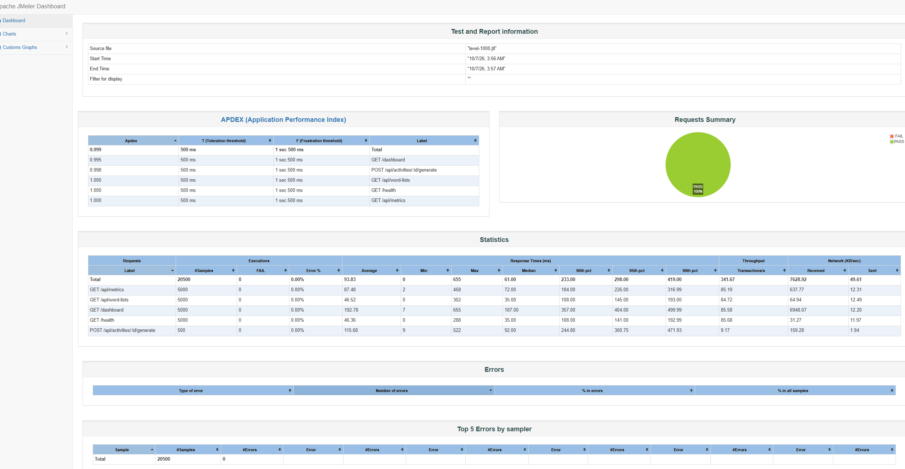

# Load testing

How the application behaves as traffic rises, measured with JMeter at four
levels, and what the results say about where it starts to strain.

---

## Setup

| | |
| --- | --- |
| Tool | Apache JMeter 5.6.3, non-GUI mode |
| Plan | `tests/load/phoneme-builder-load.jmx` |
| Runner | `tests/load/run-levels.sh` (levels 1, 10, 100, 1000; 5 loops each) |
| Target | Production build (`npm run build && npm start`) on `localhost:3000` |
| Database | SQLite via Prisma, seeded plus simulated history |
| Machine | One Windows laptop running both JMeter and the application |

The production build was tested rather than `next dev`, because the dev server
compiles each route on its first request and would add a one-off delay to the
first samples that has nothing to do with how the application performs.

### Workload

Two thread groups run side by side:

- **Read workload.** Each virtual user does `GET /health`, `GET /dashboard`,
  `GET /api/metrics` and `GET /api/word-lists`, with 200–700 ms of think time
  between requests. These leave nothing behind, so they scale with the level.
- **Write workload.** `POST /api/activities/:id/generate`, with 500–1500 ms of
  think time. Every call stores a `Generation` row, so this group runs at a
  tenth of the read users (minimum one). That keeps a high-concurrency run from
  burying the real usage history under machine-made records.

Each request carries an assertion: a 200 status, the dashboard actually
rendering, or the API envelope reporting `ok`. A request that returned an
error page with a 200 status would still count as a failure.

---

## Results

### By level

| Level | Samples | Errors | Avg | 95th pct | Max | Throughput |
| --- | ---: | ---: | ---: | ---: | ---: | ---: |
| x1 | 25 | 0 | 12 ms | 23 ms | 24 ms | 2.8 req/s |
| x10 | 205 | 0 | 11 ms | 35 ms | 58 ms | 19.1 req/s |
| x100 | 2,050 | 0 | 12 ms | 46 ms | 152 ms | 145.1 req/s |
| x1000 | 20,500 | 0 | 94 ms | 295 ms | 655 ms | 341.7 req/s |

Every sample count is exactly what the plan should produce. At x1000, for
example, there were 1000 readers × 5 loops × 4 requests = 20,000 reads, plus
100 writers × 5 loops = 500 generations. So no request was dropped or
skipped, and none of the 22,780 requests across the four levels failed.

### By endpoint, at x1000

| Endpoint | Samples | Avg | Max |
| --- | ---: | ---: | ---: |
| `GET /dashboard` | 5,000 | 193 ms | 655 ms |
| `POST /api/activities/:id/generate` | 500 | 116 ms | 522 ms |
| `GET /api/metrics` | 5,000 | 87 ms | 458 ms |
| `GET /api/word-lists` | 5,000 | 47 ms | 302 ms |
| `GET /health` | 5,000 | 46 ms | 288 ms |



The JMeter APDEX score at x1000 was **0.999** out of 1, against a 500 ms
"satisfied" threshold.

---

## What the results show

### Up to 100 users the server is not the bottleneck

From x1 to x100 the average response time stays flat at 11–12 ms, while
throughput rises roughly in step with the number of users (2.8 → 19.1 → 145.1
requests per second). When latency holds steady as load grows, the server has
spare capacity. At these levels the request rate is set by the users' think
time, not by how fast the application can answer.

### Between 100 and 1000 users, latency starts to climb

At x1000 the average rises about 8× (12 → 94 ms) and the 95th percentile about
6× (46 → 295 ms), while throughput grows only about 2.4× (145 → 342 req/s).
When throughput stops keeping pace with users and latency rises instead,
requests have started to queue: the application is near its capacity on this
machine.

Even so, there were no errors, and 95% of requests at the heaviest level
finished in under 300 ms. That is well inside the one-second limit within
which a user's flow of thought stays uninterrupted (Nielsen, 1993).

### What "1000 users" means in this run

The runner ramps threads up gradually (1000 users over 50 seconds) so that the
test does not open every connection at once. Each reader finishes its 20
requests in about 10 seconds, so early threads finish before late ones start.
Peak simultaneous load was therefore an estimated 200 users, not 1000. The
x1000 level
is better described as 1000 users arriving over a minute than as 1000 at once.

That makes the jump in latency more telling, not less. Peak concurrency
roughly doubled from x100, yet the average response time rose eightfold. The
system crossed its comfortable limit somewhere in that range.

### The dashboard is the most expensive page, by design

`/dashboard` averages 193 ms under load, about four times the cheap endpoints.
That is the cost of a deliberate decision: every figure is computed from the
stored records when the page loads, rather than kept as a running total that
could drift out of step with the data (see *The dashboard and what it reports*
in the README). `/api/metrics` runs the same aggregations without rendering a
page, and averages 87 ms.

`/health` and `/api/word-lists` are each a single small query, yet still
average 46–47 ms at x1000, against a few milliseconds at low load. Most of
that is time spent waiting for a turn on the server, not running the query.
That fits a single Node.js process sharing one CPU with the load generator.

### Writes hold up because they are rare

Generation is the only endpoint that writes. SQLite allows one writer at a
time, so heavy concurrent writing would serialise. At a tenth of the read load,
the 500 generations averaged 116 ms with a worst case of 522 ms and no
failures. A real deployment with many teachers generating at once is where
SQLite would be the first thing to replace.

---

## Limitations

- **One machine.** JMeter and the application shared the same laptop, so they
  competed for CPU. Some of the latency at x1000 is the load generator's, which
  makes these figures a conservative estimate of the server on its own.
- **x10000 was not run.** JMeter needs roughly a megabyte of heap per thread,
  so ten thousand threads would need around 10 GB before the application got
  any memory. The results would measure the load generator running out of
  room, not the server. x1000 already shows where latency starts to rise,
  which is what the higher level would have been for.
- **Small data set.** The database holds 90 words and a few hundred usage
  records. The dashboard's aggregations will slow as the history grows,
  because they scan more rows.

## If it needed to scale further

In the order they would pay off:

1. **Cache the dashboard aggregations for a few seconds.** Most of the load is
   reads of the same figures, and a five-second-old dashboard is still useful.
   This removes the most expensive work from the hottest page without giving
   up computing from stored records.
2. **Move from SQLite to PostgreSQL** once concurrent writes matter, to remove
   the single-writer limit.
3. **Run more than one application process** behind a load balancer. The app
   keeps no state in memory between requests, so this needs no code changes.

---

## Reproducing

```bash
npm run build && npm start        # terminal 1
./tests/load/run-levels.sh        # terminal 2 (Git Bash on Windows)
```

Raw samples (`level-N.jtl`) and HTML reports (`report-N/index.html`) are
written to `tests/load/results/`. They are not committed, so each run starts
clean.

## References

Nielsen, J. (1993). *Response times: The 3 important limits*. Nielsen Norman
Group. https://www.nngroup.com/articles/response-times-3-important-limits/
